# BioPrinter PCB Designs

Custom PCB designs for a bioprinting system featuring bidirectional Peltier temperature control, UV LED curing, and pneumatic solenoid actuation.

**Designed by:** Designing Alley
**Application:** Bioprinter peripheral control boards
**Controller:** BTT Octopus V1.1 (STM32F446)

---

## Overview

This repository contains PCB designs for custom peripheral boards used in a multi-extruder bioprinting system. The designs interface with the BTT Octopus V1.1 mainboard via GPIO pins controlled through Marlin firmware.

### Board Summary

| Board | Function | Dimensions | Key Components |
|-------|----------|------------|----------------|
| [Temperature Control](#temperature-control-board) | Peltier bidirectional heating/cooling | 99mm x 69mm | ULN2003A, 3x DPDT relays |
| [Solenoid Actuator](#solenoid-actuator) | Pneumatic valve control | 30mm x 18mm | N-MOSFET (TO-252) |
| [UV LED Actuator](#uv-led-actuator-extruder-mount) | Extruder-mounted UV curing | 10mm x 11mm | 2x SMD UV LEDs |
| [UV LED Board](#uv-led-board-backpanel-controller) | Multi-channel LED driver | ~80mm x 50mm | ULN2003A, 4x potentiometers |

---

## Temperature Control Board

**Purpose:** Bidirectional Peltier temperature control for 3 zones (Extruder 0, Extruder 1, Bed)

### Schematic
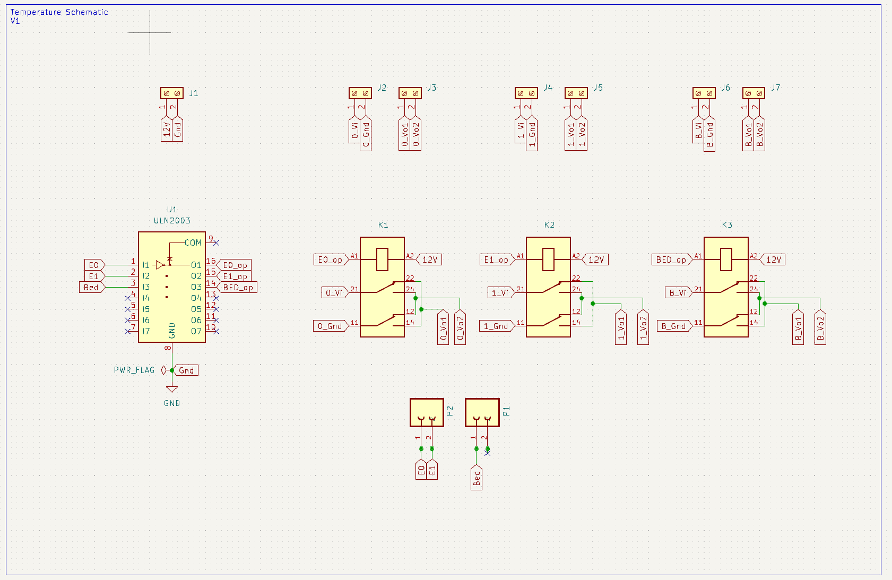

### PCB Layout


### 3D Render
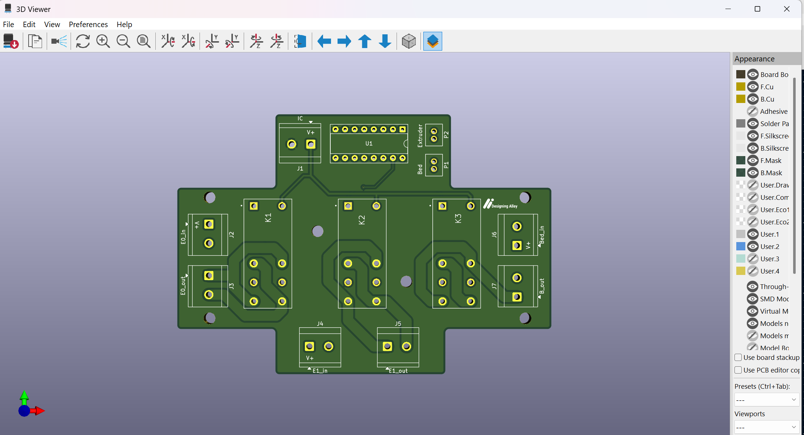

### Features
- **ULN2003A Darlington Array:** Drives 3 DPDT relay coils from low-current GPIO signals
- **3x DPDT Relays (K1, K2, K3):** Switch Peltier polarity for heating/cooling modes
  - K1: Extruder 0 (controlled by P60/FAN2)
  - K2: Extruder 1 (controlled by P61/FAN3)
  - K3: Bed (controlled by P62/FAN4)
- **Flyback Diodes:** Integrated in ULN2003A for relay coil protection
- **Screw Terminals:** High-current connections for Peltier modules

### Pin Mapping (BTT Octopus)

| Function | BTT Pin | GPIO | Relay |
|----------|---------|------|-------|
| E0 Polarity | FAN2 (P60) | PD12 | K1 |
| E1 Polarity | FAN3 (P61) | PD13 | K2 |
| Bed Polarity | FAN4 (P62) | PD14 | K3 |
| E0 Power | HE0 | PA2 | - |
| E1 Power | HE1 | PA3 | - |
| Bed Power | HE2 | PB10 | - |

### Control Logic
```
Signal HIGH (S255) -> ULN2003 sinks current -> Relay energized -> HEATING mode
Signal LOW  (S0)   -> ULN2003 off          -> Relay relaxed  -> COOLING mode
```

---

## Solenoid Actuator

**Purpose:** Control pneumatic solenoid valves for bioink dispensing

### Schematic
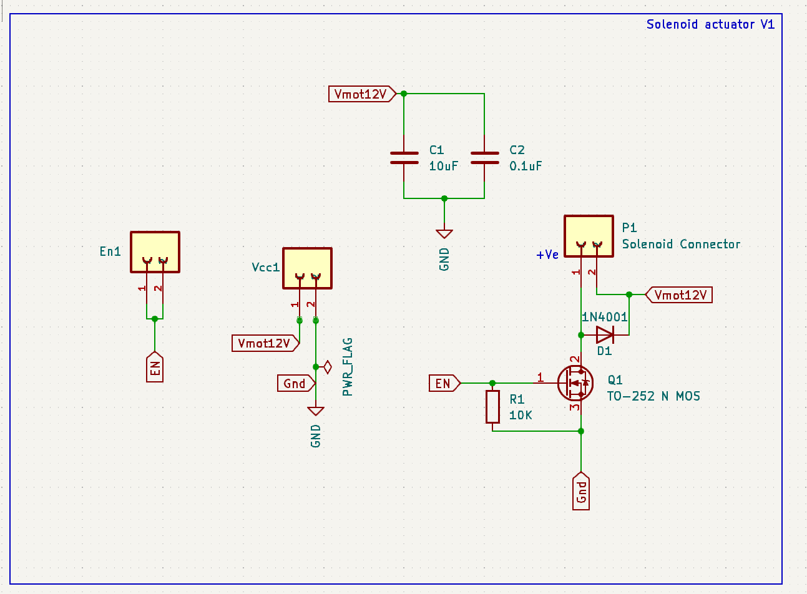

### PCB Layout
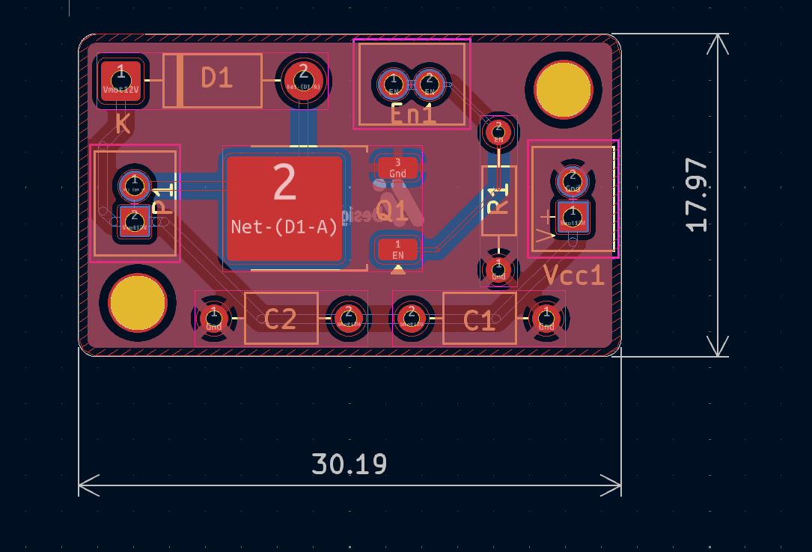

### 3D Render
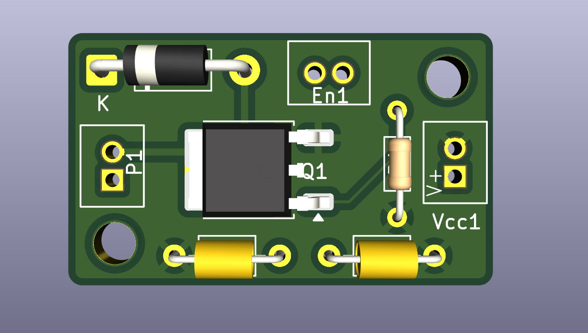

### Features
- **N-Channel MOSFET (TO-252):** High-side switching for solenoid coils
- **1N4001 Flyback Diode:** Protects MOSFET from inductive voltage spikes
- **10K Gate Resistor:** Ensures proper gate drive and noise immunity
- **Decoupling Capacitors:** Filters power supply noise
- **Compact Design:** 30.19mm x 17.97mm for tight mounting spaces

### Circuit Description
```
GPIO -> 10K Resistor -> MOSFET Gate
                        MOSFET Drain -> Solenoid -> VCC
                        MOSFET Source -> GND
                        1N4001 across Solenoid (cathode to VCC)
```

---

## UV LED Actuator (Extruder Mount)

**Purpose:** Compact UV LED board mounted directly on extruder for localized curing

### Schematic
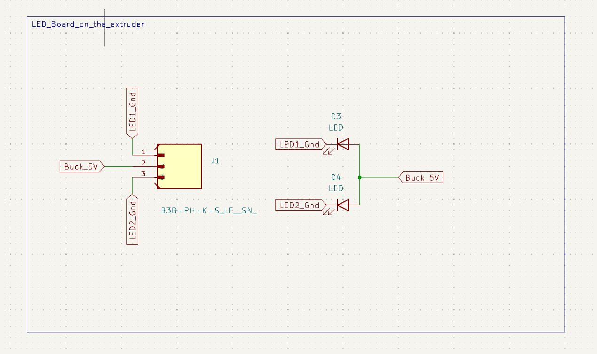

### PCB Layout
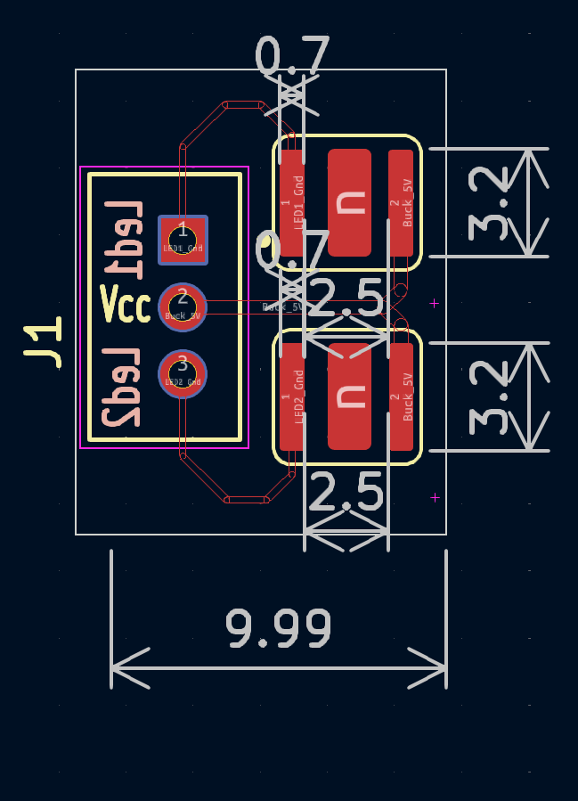

### 3D Render
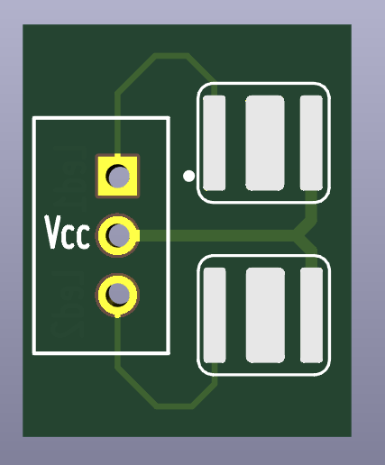

### Features
- **2x SMD UV LEDs:** Point-source UV curing at print location
- **JST Connector:** Easy connection to UV LED Board driver
- **Ultra-Compact:** ~10mm x 11mm for extruder mounting
- **No Active Components:** Passive board driven by external controller

### Mounting
- Mounts adjacent to extruder nozzle
- Provides localized UV curing immediately after deposition
- Connected via JST cable to UV LED Board

---

## UV LED Board (Backpanel Controller)

**Purpose:** Multi-channel UV LED driver with adjustable intensity

### Schematic
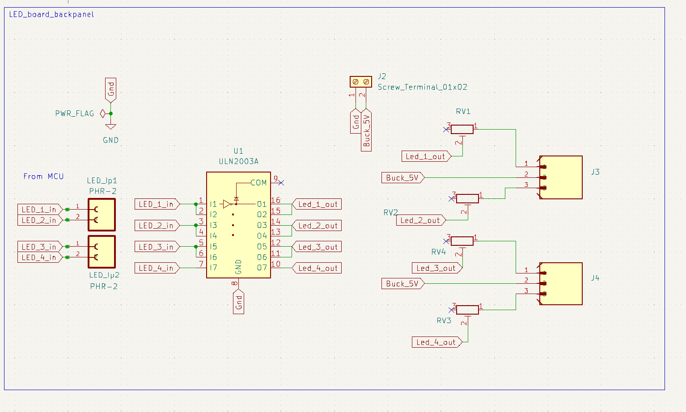

### PCB Layout
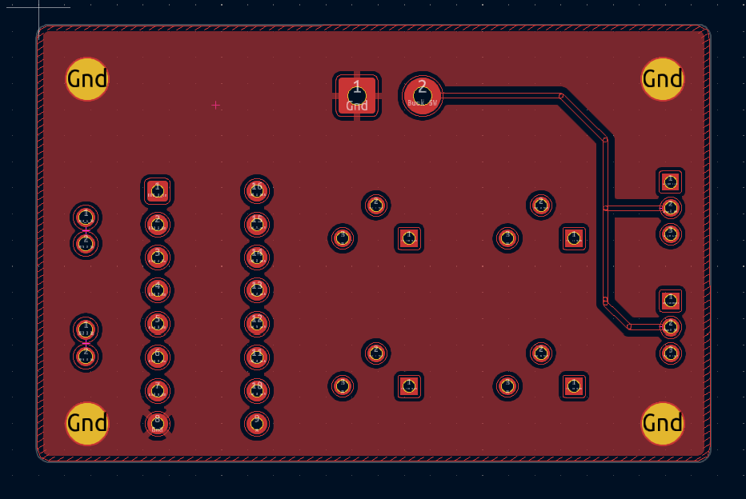

### 3D Render
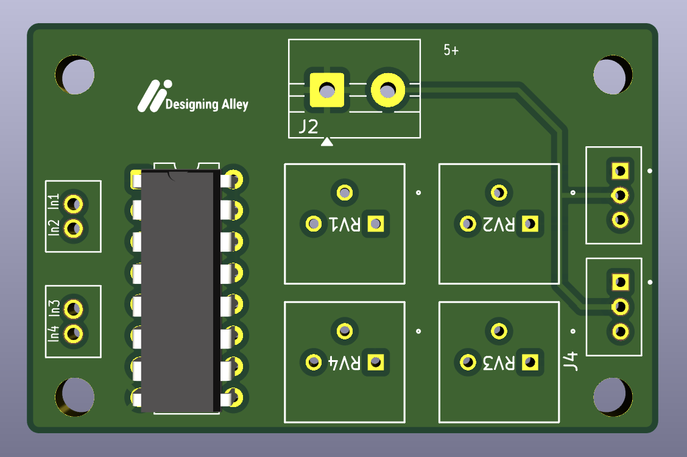

### Features
- **ULN2003A Darlington Array:** Drives 4 independent LED channels
- **4x Potentiometers (RV1-RV4):** Individual intensity adjustment per channel
- **Current Limiting Resistors:** Protects LEDs from overcurrent
- **Pin Headers:** Connection to BTT Octopus GPIO and LED actuators
- **"Designing Alley" Branding:** Silkscreen identification

### Channel Mapping

| Channel | Potentiometer | BTT Pin | Function |
|---------|---------------|---------|----------|
| CH1 | RV1 | FAN0 (P8) | UV LED 1 |
| CH2 | RV2 | FAN1 (P69) | UV LED 2 |
| CH3 | RV3 | TBD | UV LED 3 |
| CH4 | RV4 | TBD | UV LED 4 |

### Intensity Control
- Potentiometers adjust current through each LED channel
- Full CW = Maximum brightness
- Full CCW = Minimum brightness / Off

---

## Manufacturing Panel

**Purpose:** Panelized layout for efficient PCB manufacturing

### PCB Panel
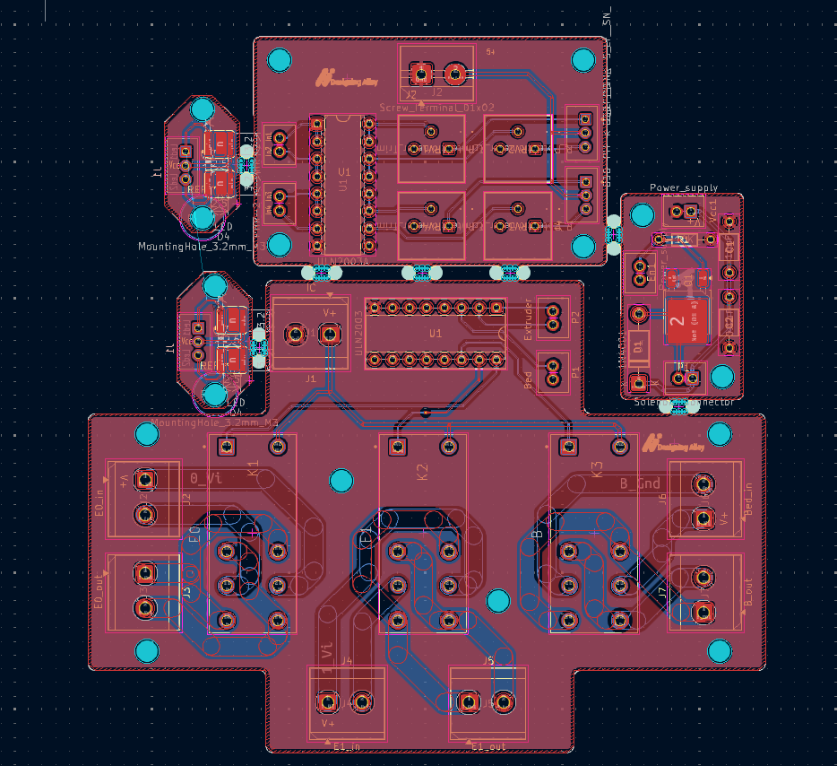

### 3D Panel Render
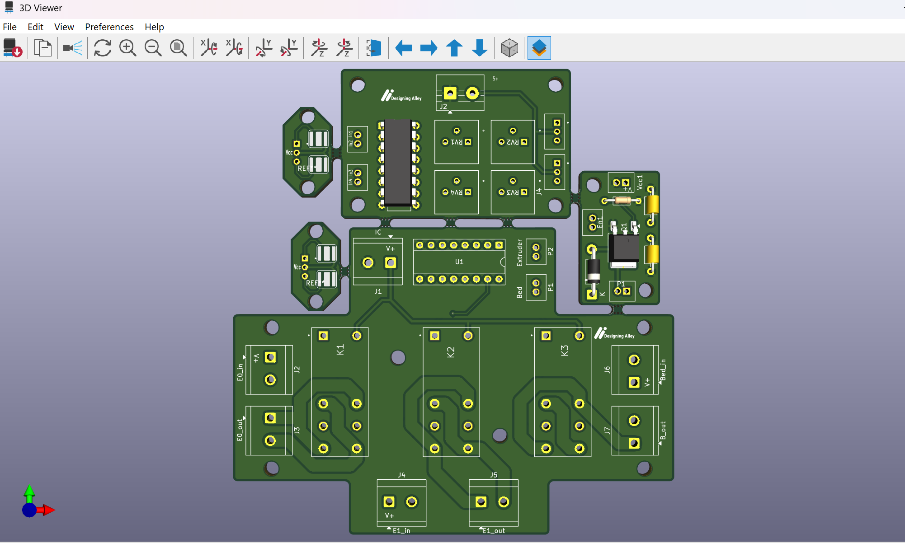

### Panel Contents
- Multiple instances of each board type
- Mouse-bite or V-groove separation tabs
- Fiducial markers for pick-and-place assembly
- Optimized for standard PCB fabrication panel sizes

---

## Firmware Integration

These boards are designed to work with Marlin firmware on the BTT Octopus V1.1. Key firmware modifications:

### Pin Unprotection (MarlinCore.cpp)
```cpp
bool pin_is_protected(const pin_t pin) {
  #ifdef CUSTOM_PELTIER1_PIN
    if (pin == CUSTOM_PELTIER1_PIN) return false;  // P61
  #endif
  #ifdef CUSTOM_PELTIER_BED_PIN
    if (pin == CUSTOM_PELTIER_BED_PIN) return false;  // P62
  #endif
  #ifdef CUSTOM_UV_LED1_PIN
    if (pin == CUSTOM_UV_LED1_PIN) return false;  // FAN0
  #endif
  #ifdef CUSTOM_UV_LED2_PIN
    if (pin == CUSTOM_UV_LED2_PIN) return false;  // FAN1
  #endif
  // ... standard protection checks
}
```

### G-Code Control Examples
```gcode
; Temperature Control (Peltier)
M42 P60 S255    ; E0 Peltier -> HEATING mode
M42 P60 S0      ; E0 Peltier -> COOLING mode
M42 P61 S255    ; E1 Peltier -> HEATING mode
M42 P62 S255    ; Bed Peltier -> HEATING mode

; UV LED Control
M42 P8 S255     ; UV LED 1 ON (FAN0)
M42 P8 S0       ; UV LED 1 OFF
M42 P69 S128    ; UV LED 2 50% (FAN1, if PWM supported)
```

---

## Bill of Materials

### Temperature Control Board
| Qty | Component | Package | Value/Part |
|-----|-----------|---------|------------|
| 1 | ULN2003A | DIP-16 | Darlington Array |
| 3 | DPDT Relay | Through-hole | 5V/12V coil |
| 1 | Screw Terminal | 2-pos | Power input |
| 3 | Screw Terminal | 3-pos | Peltier outputs |
| 1 | Pin Header | 1x7 | Signal input |

### Solenoid Actuator
| Qty | Component | Package | Value/Part |
|-----|-----------|---------|------------|
| 1 | N-MOSFET | TO-252 | Logic-level |
| 1 | 1N4001 | DO-41 | Flyback diode |
| 1 | Resistor | 0805 | 10K |
| 2 | Capacitor | 0805 | 100nF |
| 1 | Screw Terminal | 2-pos | Solenoid |
| 1 | Pin Header | 1x3 | Signal/Power |

### UV LED Actuator
| Qty | Component | Package | Value/Part |
|-----|-----------|---------|------------|
| 2 | UV LED | SMD | 365-405nm |
| 1 | JST Connector | 2-pin | Signal input |

### UV LED Board
| Qty | Component | Package | Value/Part |
|-----|-----------|---------|------------|
| 1 | ULN2003A | DIP-16 | Darlington Array |
| 4 | Potentiometer | Through-hole | 1K-10K |
| 4 | Resistor | 0805 | Current limiting |
| 1 | Pin Header | 2x4 | LED outputs |
| 1 | Pin Header | 1x4 | Signal input |

---

## License

These designs are provided for educational and personal use in bioprinting research applications.

---

## Contact

**Designer:** Designing Alley
**Repository:** [BioPrinter-PCB-Designs](https://github.com/DarkDragoXE/BioPrinter-PCB-Designs)
